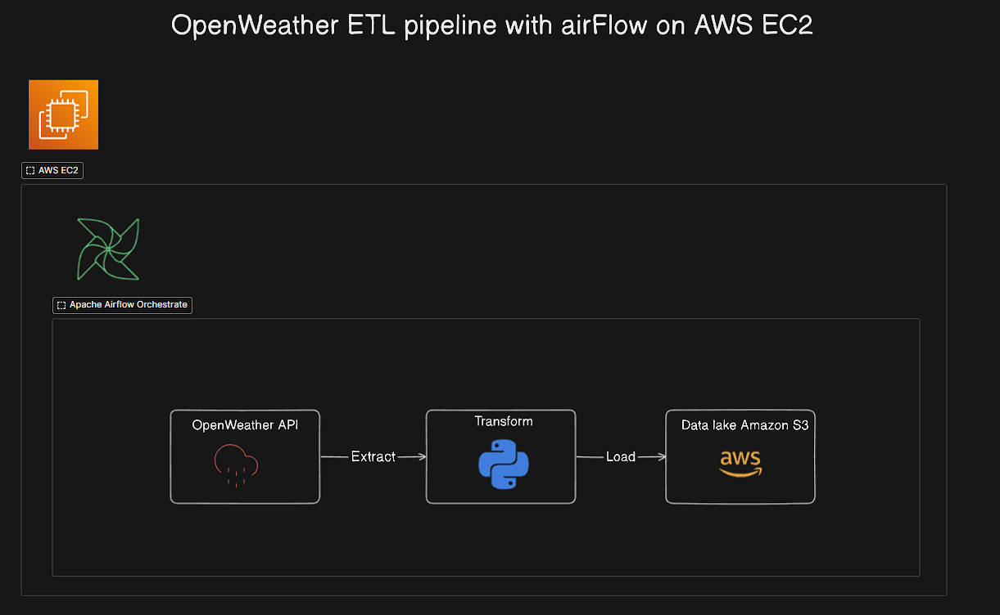
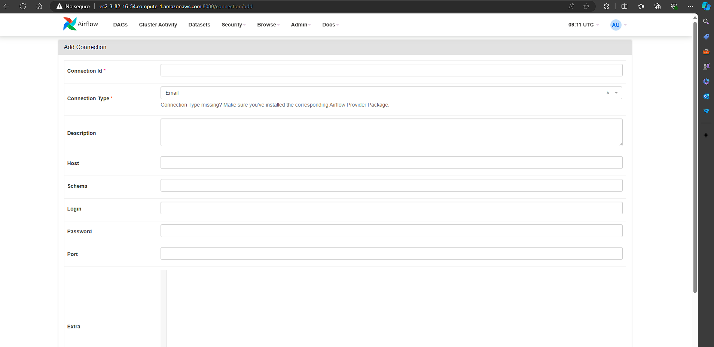
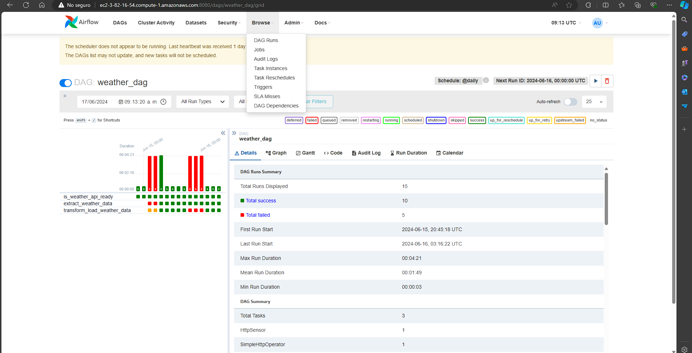
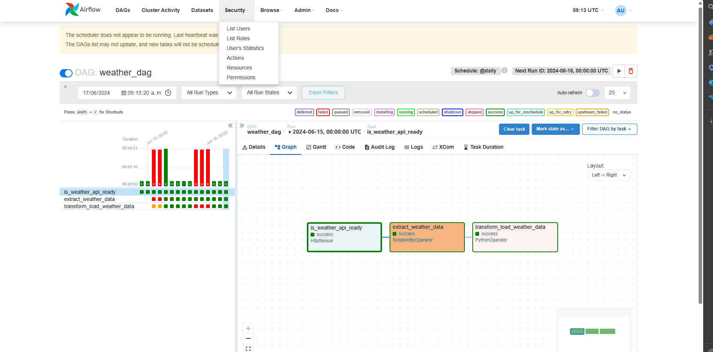

# How to build and automate a python ETL pipeline with Airflow on AWS ECS with S3 Bucket storage

## architecture design

# step 1 create an amazon web services account
 

# step 2 create a new instance of EC2

Amazon Elastic Compute Cloud (Amazon EC2) is a web service provided by Amazon Web Services (AWS) that offers resizable compute capacity in the cloud. It is designed to make web-scale cloud computing easier for developers. Here are some key features and benefits of EC2:

### Key Features:

1. **Scalability:**
   - **Elasticity:** EC2 allows you to increase or decrease capacity within minutes, not hours or days. You can commission one, hundreds, or even thousands of server instances simultaneously.
   - **Auto Scaling:** Automatically adjusts the number of instances you are running based on the demand to maintain performance and minimize costs.

2. **Variety of Instance Types:**
   - EC2 provides a wide variety of instance types optimized for different use cases, including compute-optimized, memory-optimized, storage-optimized, and GPU instances.

3. **Global Reach:**
   - EC2 is available in multiple regions and availability zones across the world, allowing you to deploy applications close to your users for better performance and to meet regulatory requirements.

4. **Security:**
   - Integrated with AWS security features, including Identity and Access Management (IAM), Virtual Private Cloud (VPC), and encryption at rest and in transit.

5. **Cost-Effectiveness:**
   - EC2 offers multiple pricing options: On-Demand Instances, Reserved Instances, Spot Instances, and Dedicated Hosts, providing flexibility to optimize cost based on different workload needs.

6. **Flexible Networking:**
   - Provides a range of networking features such as Virtual Private Clouds (VPCs), Elastic IP addresses, and enhanced networking options.

7. **Storage Options:**
   - Supports multiple storage options like Amazon Elastic Block Store (EBS), Amazon S3 for object storage, and instance storage for temporary data.

### Use Cases:

- **Web and Application Hosting:** Host websites and web applications with scalable resources.
- **Big Data Analytics:** Process large datasets quickly and efficiently.
- **Machine Learning:** Train machine learning models using powerful GPU instances.
- **Gaming:** Power online multiplayer games with low-latency, high-performance computing.
- **High-Performance Computing:** Run simulations and complex calculations for scientific research and engineering.

# step 3 connect vs code to the instance of AWS EC2

# step 4 install dependencies

- **sudo apt update**
- **sudo apt install python3-pip**
- **sudo apt install python3.10-venv**
- **python3 -m venv airflow_venv**
- **sudo pip install pandas**
- **sudo pip install s3fs**
- **sudo pip install fsspec**
- **sudo pip install apache-airflow**
- **airflow standalone**

# step 5 configure airflow connection go to admin connections add
- Connection Id: weathermap_id
- host: https://api.openweathermap.org

# finally this is the result

